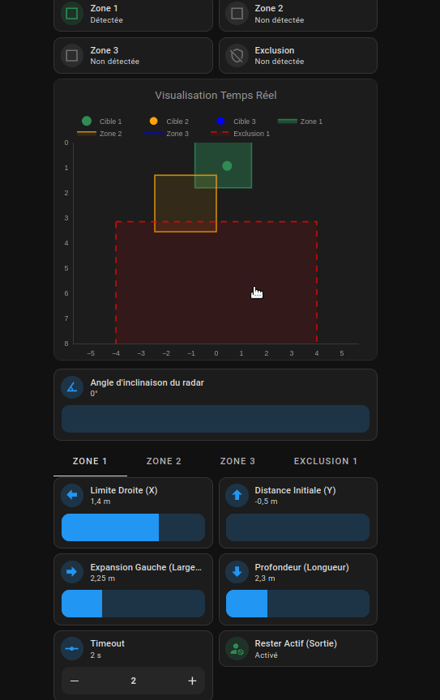

# 📡 Panneau de Contrôle Radar (LD24xx)

Ce dépôt contient les codes de cartes Dashboard (Home Assistant) et les modèles de firmwares (ESPHome) pour les capteurs de présence **HLK-LD2410** et **HLK-LD2450**.

## 🚀 Aperçu des Dashboards

| LD2410 (Analyse des Gates) | LD2450 (Zoning 2D Multi-cibles) |
| :---: | :---: |
|  |  |

---

## ⚙️ Caractéristiques Techniques

### HLK-LD2410 (Analyse par Portes)
- **Détection** : Radar 1D (Distance radiale pure).
- **Structure** : Découpage de la portée en 9 zones concentriques (G0 à G8).
- **Données** : Mesure des énergies de mouvement ("Move") et de présence statique ("Still") pour chaque porte.
- **Calcul Dynamique** : Conversion automatique des Gates en mètres selon la résolution de distance paramétrée.

### HLK-LD2450 (Cartographie 2D)
Le firmware est conçu pour exposer l'intégralité des réglages et capteurs en **mètres**.
- **Cibles** : Suivi simultané de 3 personnes maximum (Positionnement X/Y).
- **Zoning** : Support de **3 zones de présence** et **1 zone d'exclusion** (sur ce modèle).
- **Compensation d'angle** : Gestion logicielle de l'inclinaison physique du capteur.
- **Target Must Leave Zone** : Option permettant de verrouiller l'occupation d'une zone tant que la cible est suivie par le radar, éliminant le flickering.

---

## 🙏 Crédits
* **LD2450** : Basé sur le projet [53l3cu5/ESP32_LD2450](https://github.com/53l3cu5/ESP32_LD2450) (⚠️ **plus maintenu**). Outil de génération : [53l3cu5.github.io](https://53l3cu5.github.io).
* **LD2410** : Exploite le composant natif `ld2410` d'ESPHome.

---

## 📦 Prérequis Dashboard (HACS)
L'installation des modules frontend suivants est indispensable pour le rendu des cartes :
- `Mushroom Cards`, `Plotly Graph Card`, `Config Template Card`, `Tabbed Card`, `Stack In Card`.

---

## 🔧 Utilisation

### 1. Sélection Dynamique & Nommage
Le Dashboard construit les entités par concaténation. Le nom de l'ESP sélectionné doit correspondre exactement à l'ID technique (slug) de l'appareil dans Home Assistant (ex: `esp_salon02`).

### 2. Réactivité des réglages (Substitutions)
Pour une calibration fluide, les modèles utilisent des substitutions de fréquence de remontée :

| Mode | Usage | LD2410 | LD2450 |
| :--- | :--- | :--- | :--- |
| **🔧 Réglage** | Tracé visuel réactif | `1s` | `250ms` |
| **🏠 Production** | Usage stable quotidien | `60s` / `15s` | `1500ms` |

---
*Les fichiers sources sont organisés dans les dossiers respectifs `/ld2410` et `/ld2450`.*
